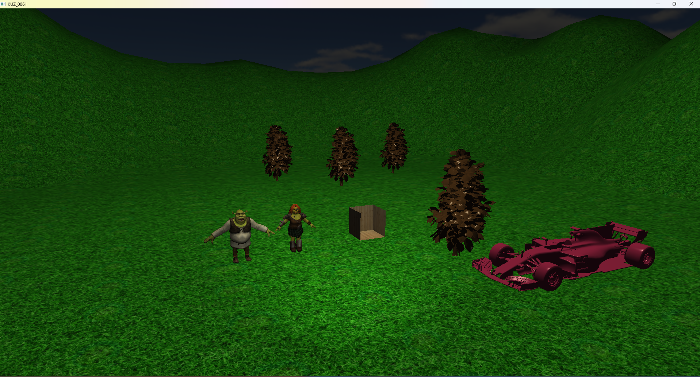
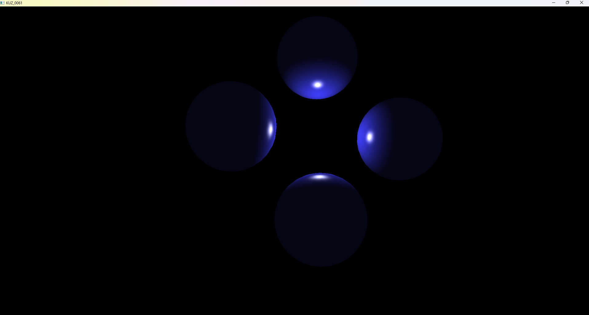
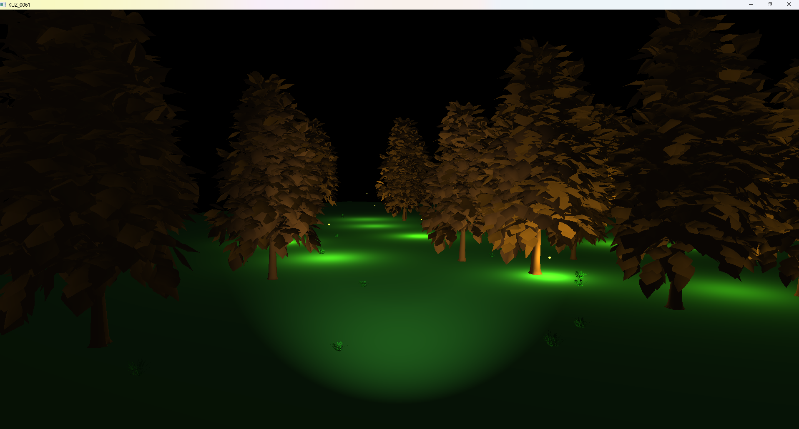
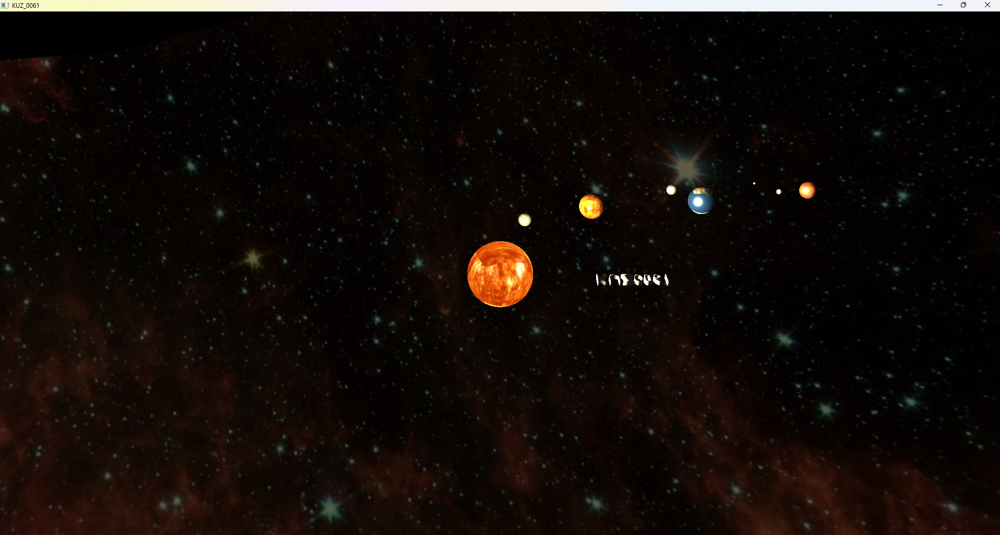
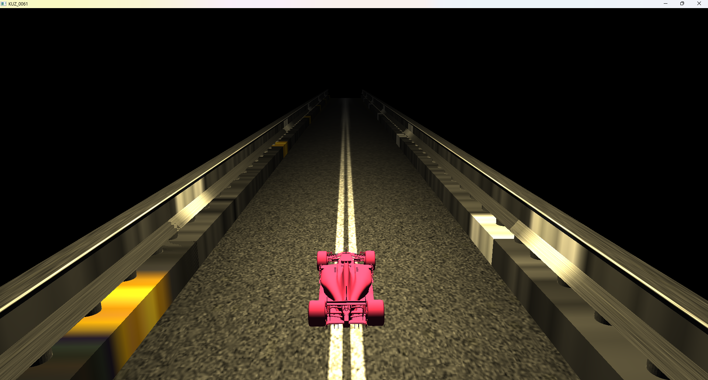
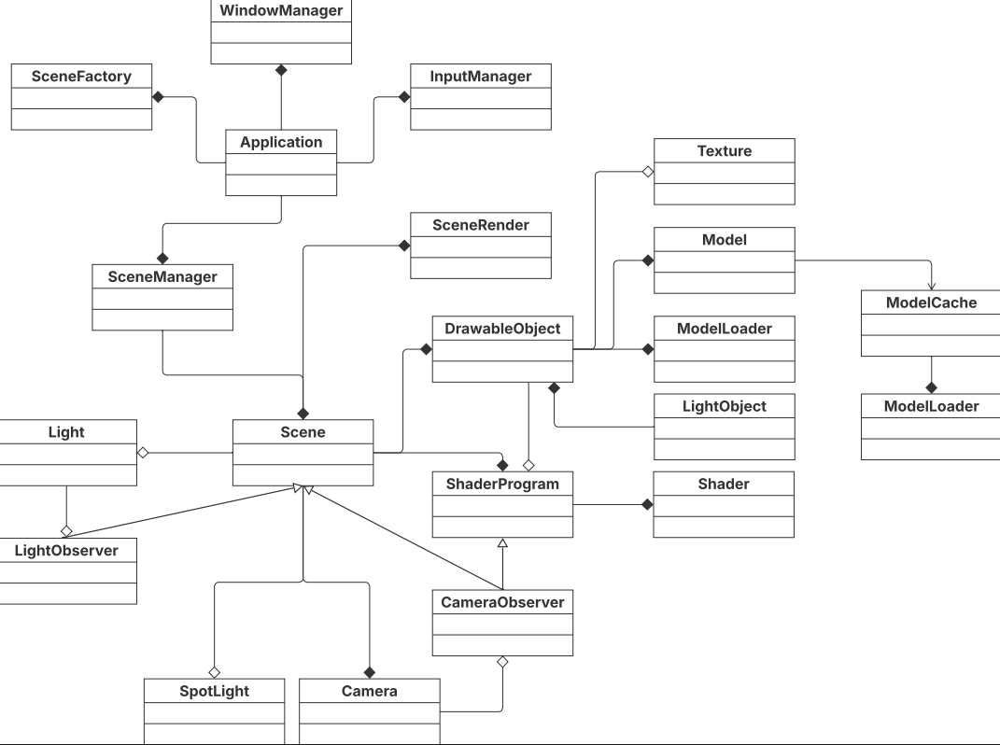
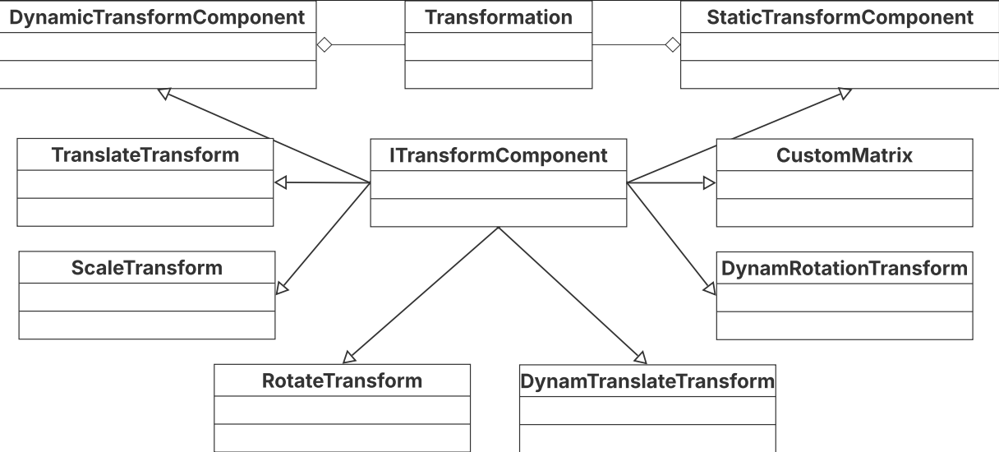

# OpenGL Graphics Engine - Educational Project

## Description

Educational project for the **"Computer Graphics Fundamentals"** (ZPG) course, demonstrating fundamental concepts of 3D graphics, object-oriented programming, and architectural design patterns.

The project implements a fully functional graphics engine with support for various lighting models, object transformations, texturing, and camera control.

---

## Screenshots

### Scene 1


### Scene 2


### Scene 3


### Scene 4


### Scene 5


---

## Key Features

### 🔦 Lighting Models

Three classic lighting models implemented:

- **Phong Shading** (`phong_vertex.glsl`, `phong_fragment.glsl`)
  Per-fragment lighting calculation with normal interpolation for smooth shading

- **Blinn-Phong Shading** (`blinn_vertex.glsl`, `blinn_fragment.glsl`)
  Optimized lighting model using half-vector for specular highlight calculation

- **Lambert Shading** (`lambert_vertex.glsl`, `lambert_fragment.glsl`)
  Diffuse lighting without specular component

Support for:
- Point lights with attenuation (`Light`)
- Spotlights with cone angle (`SpotLight`)
- Multiple light sources (up to 20 simultaneously)
- Ambient, Diffuse, and Specular components

### 🔄 Transformation System

Flexible object transformation system:

- **Translate** - object movement in space
- **Rotate** - rotation around axes
- **Scale** - scaling
- **Dynamic transformations** - animated changes (rotation, movement)
- **Transformation composition** - combining multiple transformations into chains

### 📦 Additional Features

- Object texturing (loading from files)
- Camera control (FPS-style)
- 3D model loading (OBJ format)
- Scene system for organizing different demonstrations
- Model caching for memory optimization

---

## Architectural Patterns

The project demonstrates proper application of object-oriented programming and architectural patterns:

### 🔍 Observer Pattern

**Purpose:** Notify dependent objects about state changes

**Implementation:**

```cpp
// Camera.h - Subject
class Camera {
    std::vector<CameraObserver*> observers;
    void attach(CameraObserver* observer);
    void notify();  // Notifies observers
};

// CameraObserver.h - Observer Interface
class CameraObserver {
    virtual void onCameraChanged(Camera* camera) = 0;
};

// ShaderProgram.h - Concrete Observer
class ShaderProgram : public CameraObserver {
    void onCameraChanged(Camera* camera) override;
    // Updates shader uniform variables
};
```

**Application:**
- `Camera` → `ShaderProgram` - when camera position/direction changes, view/projection matrices are automatically updated in shaders
- `Light` → `LightObserver` - when light parameters change, uniform variables are updated

**Benefits:**
- Loose coupling between camera and shaders
- Easy to add new observers without modifying Camera class
- Automatic state synchronization

### 🏗️ Composite Pattern

**Purpose:** Organize objects into tree structures to represent hierarchies

**Implementation:**

```cpp
// ITransformComponent.h - Component Interface
class ITransformComponent {
    virtual glm::mat4 getMatrix() const = 0;
    virtual void update(float deltaTime) {}
};

// StaticTransformComponent.h - Composite
class StaticTransformComponent : public ITransformComponent {
    std::vector<std::unique_ptr<ITransformComponent>> components;
    void add(ITransformComponent* component);
    glm::mat4 getMatrix() const override;  // Multiplies matrices of all components
};

// TranslateTransform.h - Leaf
class TranslateTransform : public ITransformComponent {
    glm::mat4 getMatrix() const override;
};
```

**Application in Transformations:**

```cpp
// Creating complex transformation
auto transform = new StaticTransformComponent();
transform->add(new TranslateTransform(glm::vec3(1.0, 0.0, 0.0)));
transform->add(new RotateTransform(45.0f, glm::vec3(0.0, 1.0, 0.0)));
transform->add(new ScaleTransform(glm::vec3(2.0, 2.0, 2.0)));

// Result: single matrix = T * R * S
glm::mat4 finalMatrix = transform->getMatrix();
```

**Benefits:**
- Uniform handling of simple and composite transformations
- Easy to add new transformation types
- Separation of static (cached) and dynamic (recalculated each frame) components

### 🏭 Factory Pattern

**Purpose:** Encapsulate object creation

**Implementation:**

```cpp
// SceneFactory.h
class SceneFactory {
    Scene* createScene1(float aspectRatio);
    Scene* createScene2(float aspectRatio);
    Scene* createScene3(float aspectRatio);
    // ...
public:
    Scene* createScene(int sceneID, float aspectRatio);
};
```

**Application:**
- `SceneFactory::createScene(int sceneID)` - creates different demonstration scenes with preset objects, lighting, and camera
- Encapsulates complex scene creation logic (object placement, lighting setup)

**Benefits:**
- Centralized scene creation management
- Easy to add new scenes
- Code reuse for configuration

---

## OOP Principles

The project follows the **Single Responsibility Principle (SRP)** - each class is responsible for only one task:

| Class | Responsibility |
|-------|----------------|
| `Camera` | Managing camera parameters and view/projection matrices |
| `Light` | Point light source parameters |
| `SpotLight` | Spotlight parameters |
| `ShaderProgram` | Compilation, linking, and shader program management |
| `Shader` | Loading and compiling individual shader (vertex/fragment) |
| `Model` | Storing geometric data (vertices, VBO, VAO) |
| `Texture` | Loading and texture management |
| `Scene` | Containing and managing scene objects |
| `SceneManager` | Managing scene switching |
| `SceneRenderer` | Rendering active scene |
| `WindowManager` | Initializing and managing GLFW window |
| `InputManager` | Handling keyboard and mouse input |
| `ModelCache` | Caching loaded models |
| `DrawableObject` | Representing individual 3D object with all its properties |

---

## UML Class Diagram




---

## Project Structure

```
Project1/
├── Application.h/cpp          # Main application class
├── WindowManager.h/cpp        # GLFW window management
├── InputManager.h/cpp         # User input handling
├── Camera.h/cpp               # Camera
├── CameraObserver.h           # Camera observer interface
├── Light.h/cpp                # Point light source
├── SpotLight.h/cpp            # Spotlight
├── LightObserver.h            # Light observer interface
├── Shader.h/cpp               # Shader
├── ShaderProgram.h/cpp        # Shader program (Observer)
├── Model.h/cpp                # 3D model
├── ModelCache.h/cpp           # Model cache
├── ModelLoader.h/cpp          # OBJ model loader
├── Texture.h/cpp              # Texture
├── DrawableObject.h/cpp       # Drawable object
├── Scene.h/cpp                # Scene
├── SceneManager.h/cpp         # Scene manager
├── SceneRenderer.h/cpp        # Scene renderer
├── SceneFactory.h/cpp         # Scene factory
├── ITransformComponent.h      # Transformation interface (Composite)
├── StaticTransformComponent.h/cpp    # Static transformation composite
├── DynamicTransformComponent.h/cpp   # Dynamic transformation composite
├── Transformation.h/cpp       # Object transformation management
├── TranslateTransform.h/cpp   # Translation
├── RotateTransform.h/cpp      # Rotation
├── ScaleTransform.h/cpp       # Scaling
├── DynamicRotateTransform.h/cpp      # Dynamic rotation
├── DynamicTranslateTransform.h/cpp   # Dynamic translation
├── CustomMatrixTransform.h/cpp       # Custom matrix
├── shaders/
│   ├── phong_vertex.glsl
│   ├── phong_fragment.glsl
│   ├── blinn_vertex.glsl
│   ├── blinn_fragment.glsl
│   ├── lambert_vertex.glsl
│   ├── lambert_fragment.glsl
│   └── constant_vertex.glsl
│   └── constant_fragment.glsl
├── models/
│   ├── sphere.h
│   ├── suzi_flat.h
│   ├── suzi_smooth.h
│   ├── tree.h
│   ├── bushes.h
│   └── ...
└── texture/
    ├── sun.jpg
    ├── earth.jpg
    ├── moon.jpg
    └── ...
```

---

## Technologies

- **Language:** C++17
- **Graphics API:** OpenGL 3.3+
- **Libraries:**
  - GLFW - window creation and input handling
  - GLEW - OpenGL extension loading
  - GLM - mathematical operations (vectors, matrices)
  - STB Image - texture loading
  - Tiny OBJ Loader - 3D model loading

---

## Build and Run

### Requirements

- Visual Studio 2019/2022 (or compatible C++17 compiler)
- OpenGL 3.3+
- GLFW, GLEW, GLM (libraries)

### Instructions

1. Open the project in Visual Studio
2. Ensure all dependencies are configured
3. Build the project (Ctrl+Shift+B)
4. Run (F5)

---

## Controls

- **W/A/S/D** - camera movement
- **Mouse** - camera rotation
- **1-5** - switch between scenes
- **ESC** - exit
